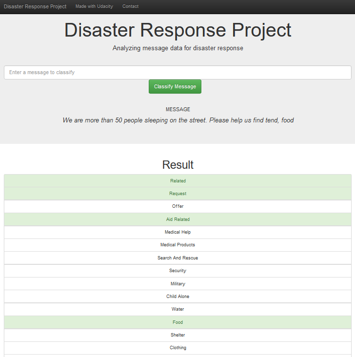

# Machine Learning Pipeline for Disaster Response Messages

This GitHub repository contains all peace of code that analyse thousands of text messages created during an emergence situation, such as a natural disaster. This project provides a solution to process these type of messages easily and fastly through a web app to give adequate support to people in emergencing situations.

The apperance of the web app is shown bellow. Basically, the text message provided by the user is classified it into 36 categories, such as 'Water', 'Home', 'Hospital', 'Route', etc.

The web app implements in the backend a machine learning pipeline that uses Natural Language processing uses Random Forest classifier. The data used to train and test the machine learning pipeline come from [Eight Figure](https://www.figure-eight.com/).

## Installation

### Dependencies
The analysis of these data was implemented in Python. The libraries used in this project are:
- Scikit-learn
- NumPy
- Pandas
- SQL Alchemy 
- Regular Expressions (re)
- Pickle
- NLTK
- Pyplot
- Flask

## File description
The project is composed of three main folders:
1. **Data:** The `data` folder contains the python stript `process_data.py` that reads a csv file (i.e. `disaster_categories.csv` and `disaster_messages.csv`) contaning raw disaster messages extracted from [Eight Figure](https://www.figure-eight.com/). It also cleans the data and saves it into a SQL database named `DisasterResponse.db`. To run the script `process_data.py`, you can use the command bellow:

> python data/process_data.py data/disaster_messages.csv data/disaster_categories.csv data/DisasterResponse.db

2. **Models**: The folder `models` contains the script `train_classifies.py` that trains a machine learning pipeline using Random Forest classifier and Natural Languade processing. This script receives as input the `DisasterResponse.db` SQL database and gives as output the machine learning pipeline `classifier.pkl`. To run the script, you can use the command bellow:

> python models/train_classifier.py data/DisasterResponse.db models/classifier.pkl

3. **App**: The folder `app` contains the web app that provides a intuitive user interface to process disaster messages easially using the machine learning pipeline in backend. To run the web app, you can use the command bellow in the app's directory:

> python run.py 

Obs.: To set access the web app in the browser, go to http://0.0.0.0:3001/ or `localhost:3001`.

## License and Acknowledgment
This code is open source and can be used for any purpose. I would like to thank Udacity for providing the infrastructure that allows me to build this project.
